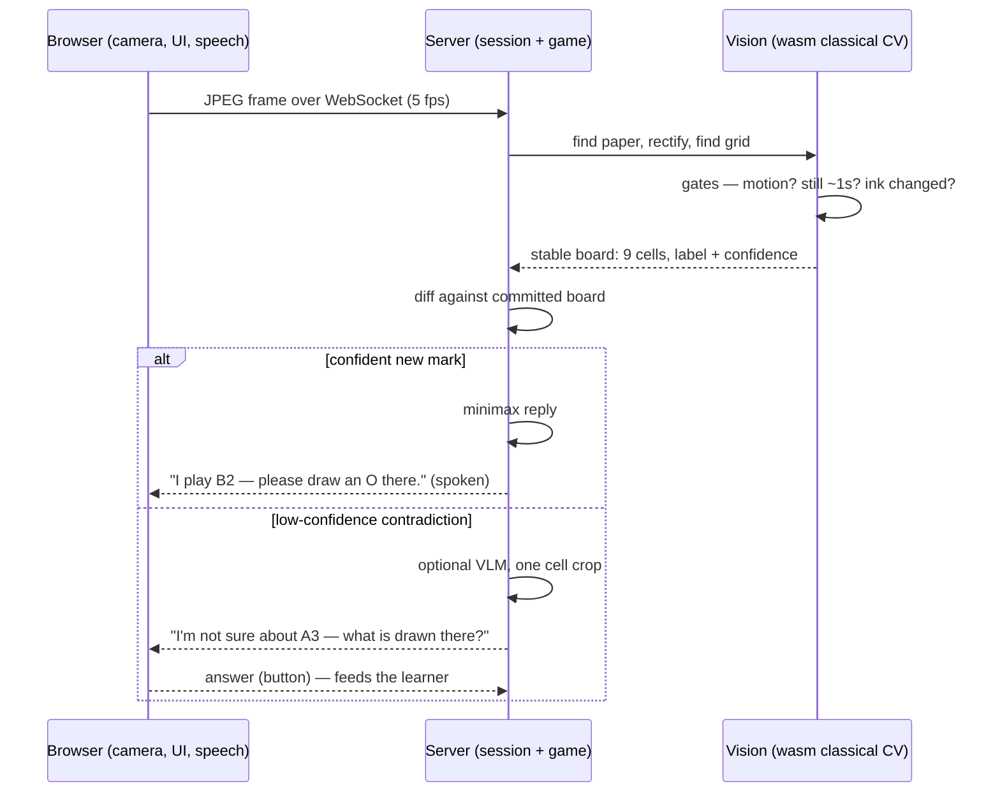

# VisTacToe

A real-time video agent that plays tic-tac-toe against you on **paper**. Point a webcam at a hand-drawn 3×3 grid; the agent watches continuously, detects your marks as you draw them, announces its replies out loud (you draw them for it — the human is the only hand), and keeps playing until someone wins or it's a draw.

Built for the Vistral VP R&D take-home. Design rationale: [`docs/decisions.md`](docs/decisions.md) · game-agnostic architecture (Section 3): [`docs/architecture.md`](docs/architecture.md).

## Running a game (under ten minutes)

You need: **Node ≥ 22**, a **webcam** (or phone via Continuity Camera), **paper and a dark pen**.

```bash
npm install        # no native builds, no API keys, no conda — wasm all the way
npm run dev        # starts the server (:3000) and the web client (:5173)
```

1. Open **http://localhost:5173** and allow camera access.
2. Point the camera down at a blank sheet of paper — the agent will ask you (on screen and out loud) to **draw a 3×3 grid**. Draw it big, covering most of the page.
3. The game starts automatically: **you are X and you move first.** Draw an X in any cell, then take your hand out of frame.
4. The agent announces its move — e.g. *"I play B2 — please draw an O there."* (columns are A–C left to right, rows 1–3 top to bottom). Draw its O where it asked.
5. Repeat until it announces the result. Show it a fresh grid for a rematch.

If it isn't sure about a mark it will ask you ("I'm not sure about A3 — what is drawn there?") — answer with the on-screen buttons. Good light and a thick dark pen keep those questions rare.

## How it works (one move)



Ink is truth: every stable observation re-reads all 9 cells and reconciles them against the committed board, so a moved page, a restarted process, or a mark the agent never saw drawn all recover for free. The full knob reference and a "where does each piece of logic live" map are in [`docs/tuning.md`](docs/tuning.md).

## Optional: VLM fallback tier

By default perception is 100% local classical CV. With an [OpenRouter](https://openrouter.ai) key, low-confidence marks get one shot at a vision model before the agent bothers you:

```bash
OPENROUTER_API_KEY=sk-or-... VLM_ENABLED=true npm run dev
```

It sends a single ~160px cell crop (never the whole board — see decisions doc for why) to `google/gemini-3.1-flash-lite`, failing over to `openai/gpt-5.6-luna`, ~$0.0004 per call, 0–3 calls per game. Sanity-check the tier live: `OPENROUTER_API_KEY=... npx tsx packages/server/scripts/vlm-smoke.ts`.

## The agent gets smarter (Section 2)

Every game leaves inspectable state under `data/`:

- `data/games/<id>/events.jsonl` — every observation, escalation, answer and move
- `data/games/<id>/summary.json` — the per-game metrics: asks, misreads, corrections, VLM calls
- `data/calibration.json` — the learned state: your handwriting profile (feature centroids of your confirmed X's and O's) and a self-tuned escalation threshold

Marks that look like ones you've already verified get a confidence boost, so escalations drop game over game. See the trend:

```bash
npm run feedback:report
```

**Improvement vs variance:** the replay A/B test (`packages/server/test/feedback.test.ts`) plays the *identical* deterministic frame sequence with a cold store and a warmed one — the drop in interventions is attributable to the learned state alone. It runs in CI.

## Configuration

Everything runs with zero configuration. When you want to change something:

| Variable | Default | Effect |
|---|---|---|
| `PORT` | `3000` | Server port (positive integers only) |
| `VISTACTOE_CONFIG` | `config.json` | Path to an optional JSON file overriding any [`AppConfig`](packages/shared/src/config.ts) key (turn order, thresholds, VLM models…) |
| `VLM_ENABLED` | `false` | `true` enables the VLM tier (needs the key below) |
| `OPENROUTER_API_KEY` | — | Without it the VLM tier is force-disabled — the system is fully offline by default |
| `VISTACTOE_DATA` | `data` | Root for the per-game logs and learned calibration |
| `VISTACTOE_DEBUG` | — | Directory for periodic PNG dumps of what the vision pipeline sees |

Precedence: built-in defaults ← config file ← environment. The tunable knobs (confidence threshold, stability window, and friends) are catalogued in [`docs/tuning.md`](docs/tuning.md).

## Tests

```bash
npm test           # 100 tests: engine, session FSM, CV, tiers, feedback, full e2e
npm run typecheck
```

No camera, network, or API key needed — the e2e boots the real server and plays complete games over a real WebSocket using synthetically rendered "camera" frames (perspective, pen wobble, sensor noise, hand occlusion).

## Layout

```
packages/engine    game rules + perfect-play minimax (pure, zero deps)
packages/shared    protocol types, config schema
packages/vision    classical CV: rectify → stability gate → classify; synthetic scene renderer
packages/server    session state machine, tier escalation, VLM client, feedback store, Fastify+WS
packages/web       browser client: camera capture, board UI, speech output
e2e                full-loop tests against the real server
docs               decisions + game-agnostic architecture design
```

## Troubleshooting

- **"Show me the paper" forever** — more light, less glare; the page should be the brightest thing in frame and fully visible.
- **Grid not found** — draw it bigger (most of the page) with 2 clear vertical + 2 horizontal strokes; a bordered grid works too.
- **Marks misread** — use a thicker pen; close your O's, cross your X's; or enable the VLM tier and let it absorb the ambiguity.
