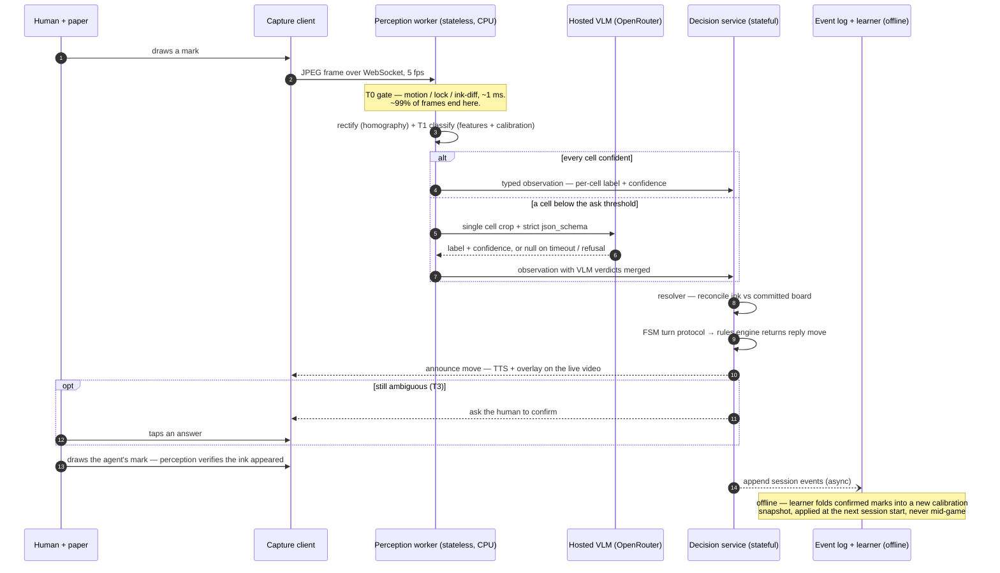

# 1 — End-to-end flow

One move, from a frame arriving to the move being communicated. Solid participants are built today; the offline lane at the right is the learning path.

**Where inference runs.** The capture client runs no inference — it ships JPEGs and renders overlays. T0–T1 are CPU-only classical CV on stateless perception workers (`packages/vision/`), so per-stream cost is milliseconds, not GPU-seconds. The only online model is T2: a hosted VLM reached through OpenRouter (`packages/server/src/vlm.ts`) — speed-tier models (`google/gemini-3.1-flash-lite` with `openai/gpt-5.6-luna` as in-request cross-vendor failover), because the task is a single-cell classification crop with a strict `json_schema`, not scene understanding. Two offline model uses: rules compilation (Claude Opus 5, once per new game — see [`03-rules-ingestion.md`](03-rules-ingestion.md)) and, for games too large to solve, an LLM move proposer behind a legality validator (see the main diagram).

**The offline path.** Every session appends to the event log (`packages/server/src/feedback/store.ts`). The learner folds confirmed marks and escalation outcomes into per-(tenant, game, player) calibration snapshots; a snapshot activates only at session start and only after passing the replay-eval gate ([`05-feedback-at-scale.md`](05-feedback-at-scale.md)). Nothing learned ever changes behavior mid-game.
