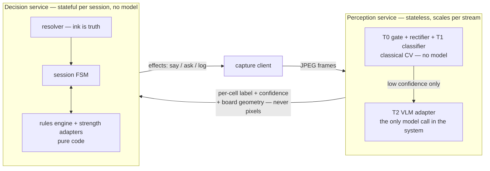

# 2 — Services and boundaries

**Perception** is stateless: any worker can process any frame given (stream id → locked homography, calibration ref), so it scales horizontally per camera stream and owns nothing durable — its only state is the in-memory board lock per stream, rebuildable from the next stable frame. It is also the only service that touches a model at all, and even then only the optional T2 tier; T0/T1 are pure CPU (`packages/vision/`).

**Decision** is stateful per session — committed board, whose turn, pending announcement — kilobytes, sticky-routed, and it owns the game truth. It needs **no** model: rules are interpreted from the spec, and strength comes from code (solvers, engine adapters); an LLM move proposer, where used, sits behind the interpreter's legality validator and can never place an illegal move.

**What crosses the boundary** is small and typed: per-cell `{label, confidence}` readings plus board geometry going one way, `say / ask / log` effects coming back — never pixels. This is what makes the perception fleet swappable (better CV, a different VLM vendor) without touching game logic. The contract already exists as `Observation` / `Effect` in `packages/shared/src/session.ts`, with the VLM behind the injectable `VlmClient` interface in `packages/server/src/vlm.ts`.
