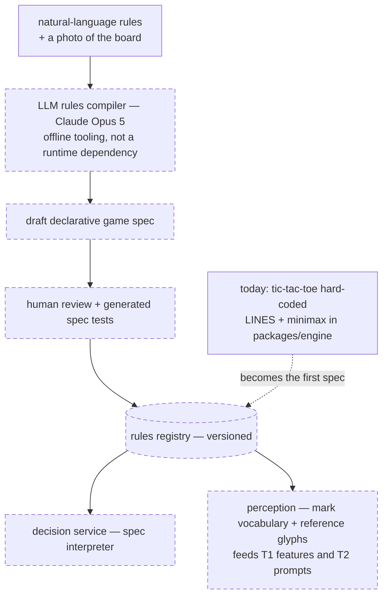

# 3 — Rules ingestion

A new game is a *document*, not a deploy. Everything below the top node is proposed; today's tic-tac-toe becomes the registry's first spec.



**The spec** is declarative and complete enough for both services: board topology (grid dimensions or an arbitrary adjacency graph), mark vocabulary (symbols plus reference glyphs the T1 classifier and the T2 prompt are parameterized by), turn protocol (who moves when, what a legal move is — as validatable predicates), terminal conditions, and an optional strength-adapter reference. The tic-tac-toe instance is trivial:

```yaml
game: tic-tac-toe/v1
board:    { topology: grid, rows: 3, cols: 3 }
marks:    [X, O]                    # + reference glyphs
turn:     alternate; one mark per turn; empty cells only
terminal: three-in-line wins; full board draws
strength: exhaustive-solver
```

**The compiler is tooling, not runtime.** Natural-language rules are LLM-compiled into the spec format once, human-reviewed alongside generated spec tests, then versioned in the registry — the live path never calls it. The decision service *interprets* the spec; perception reads only the vocabulary from it. What this replaces in today's code is exactly the hard-coded surface: `CELL_COUNT`/`LINES` in `packages/engine/src/board.ts` and the `'X' | 'O' | 'empty'` label enum threaded through classifier, VLM schema, and resolver.
