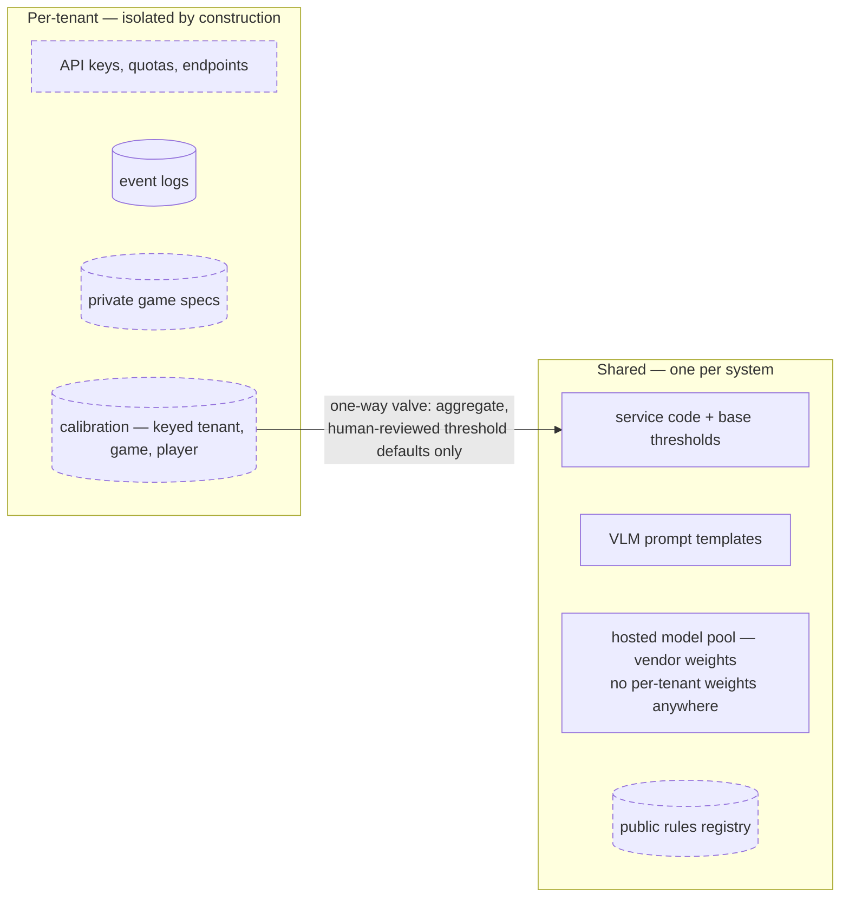

# 4 — Shared and per-tenant

**Shared across all games and all users:** the code, base confidence thresholds, VLM prompt templates, the public rules registry, and the vendor pool. All model weights are vendor-hosted commodities behind OpenRouter — there is deliberately no per-tenant fine-tune anywhere, because adaptation happens in the cheap layer (calibration), not the expensive one (weights).

**Scoped to one tenant:** API keys and quotas, per-tenant WebSocket endpoints, event logs, private game specs, and *all learned state*. Calibration is keyed (tenant, game, player) by construction — handwriting profiles are personal, so the key isn't an optimization, it's the semantics. Today's single-tenant stand-ins are `data/games/` and `data/calibration.json` in `packages/server/`.

**The one-way valve:** nothing learned from one tenant ever flows into another tenant's inference path. The only graduation route is aggregate, human-reviewed threshold defaults being promoted into shared base config — a config change with review, not a data flow.
