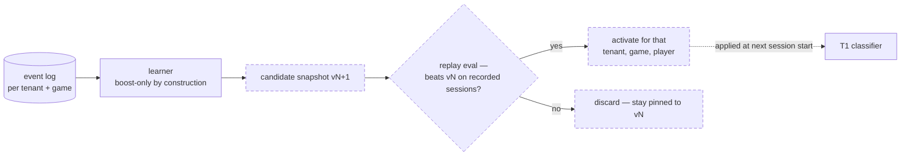

# 5 — Feedback at scale

**Where learned state lives.** In the calibration store as append-only versioned snapshots, keyed (tenant, game, player) — never in weights, never in shared config. Today's slice is `data/calibration.json` written by `packages/server/src/feedback/calibration.ts`.

**Isolation is the containment.** A bad profile's blast radius is one player of one game of one tenant — the key structure *is* the bulkhead. And the learner is safe by construction, a property already in the built code: calibration can only boost confidence toward labels the T1 classifier already produced, never lower it, never touch `empty` — so the worst possible corruption is extra asks to the human, not silent misreads.

**Promotion is gated.** A candidate snapshot must beat its predecessor on a replay eval — recorded sessions re-run deterministically against both versions — before it activates; a regression means an automatic pin to the last passing snapshot. The mechanism exists today as the replay A/B harness in `packages/server/test/feedback.test.ts` (identical frames, cold store vs warmed store, asserting fewer interventions); at scale it runs as the promotion gate rather than a test.
