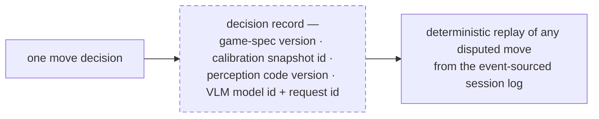
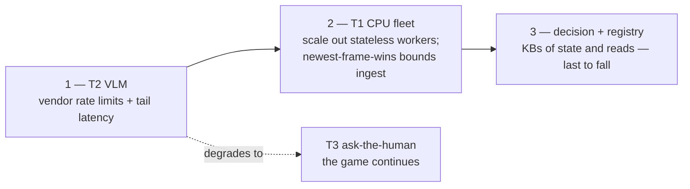

# 6 — Versioning and failure

**Every decision is traceable.** Sessions are event-sourced, and each decision logs the full provenance tuple, so any disputed move replays deterministically from the log:

Today's slice already logs most of the tuple per event (`vlm_call`, `board_observed` with feature vectors, in `data/games/*/events.jsonl`); the missing piece is stamping spec/snapshot/code versions once they exist as versioned artifacts.

**What breaks first under load** — the failure order is the cost order, and the expensive tiers are exactly the optional ones:

T2 falls first (vendor rate limits, tail latency) and degrades *by design* into asking the human — the game continues, slightly chattier. Next is T1 CPU: the fix is horizontal (workers are stateless), and per-stream newest-frame-wins backpressure — already built in the client and per-socket queue — means queues never form; the system drops staleness, not correctness. The decision tier and rules registry fall last: kilobytes of sticky state and read-mostly documents respectively. No single tier's failure ends a game; every rung of the T0→T3 ladder has the same fallback of last resort, the human across the table.
