# Architecture design — a game-agnostic live-video game agent

What the built system becomes when it must accept *any* board game's rules and play it against a human over live video, for many tenants at once. VisTacToe (tic-tac-toe, single player, one process) is a vertical slice of this design: same tiers, same boundaries, same ink-is-truth doctrine. The condensed one-page version lives at [`../architecture.md`](../architecture.md); this directory expands it with one diagram per design question.

**Legend (all diagrams):** solid nodes are built and running in VisTacToe today; dashed nodes are proposed and not built. Today's single-tenant stand-ins for the dashed stores are local JSON files under `packages/server/data/`.

```mermaid
flowchart LR
  subgraph client [Capture client — browser / phone]
    CAM["camera 5 fps JPEG"] --> WSC["WebSocket"]
    UI["board UI + TTS<br/>+ on-video overlay"]
  end

  subgraph edge [Ingest edge]
    GW["WS gateway<br/>sticky session routing"]:::proposed
    BP["backpressure —<br/>newest frame wins"]
  end

  subgraph percept [Perception service — stateless fleet, CPU]
    T0["T0 gate — motion, lock, ink-diff<br/>no model, ~1 ms/frame"]
    RECT["rectifier — board homography<br/>classical CV"]
    T1["T1 classifier — mark vocabulary<br/>features + per-player calibration"]
    T2["T2 VLM adapter — OpenRouter<br/>gemini-3.1-flash-lite → gpt-5.6-luna<br/>per-cell crops, strict json_schema"]
    T0 --> RECT --> T1
    T1 -- "low confidence only" --> T2
  end

  subgraph decide [Decision service — stateful per session]
    RES["board resolver<br/>ink-is-truth reconcile"]
    FSM["session FSM<br/>turn protocol, prompts, T3 ask-human"]
    INT["rules interpreter<br/>executes any game spec"]:::proposed
    SOLVE["exhaustive solver<br/>memoized minimax"]
    ENGA["engine adapter<br/>Stockfish-class"]:::proposed
    LLMP["LLM move proposer<br/>always behind a legality validator"]:::proposed
    RES --> FSM <--> INT
    INT --> SOLVE
    INT --> ENGA
    INT --> LLMP
  end

  subgraph rulesplane [Rules plane — offline tooling]
    NL["natural-language rules"] --> COMP["rules compiler<br/>Claude Opus 5, one-shot"]:::proposed
    COMP --> HREV["human review"]:::proposed
    HREV --> REG[("rules registry<br/>versioned declarative specs")]:::proposed
  end

  subgraph learn [Feedback — offline path]
    LOG[("event log<br/>per tenant + game")]
    LEARN["calibration learner<br/>boost-only"]
    EVAL["replay-eval<br/>promotion gate"]:::proposed
    CAL[("calibration snapshots<br/>keyed tenant, game, player")]:::proposed
    LOG --> LEARN --> EVAL --> CAL
  end

  WSC --> GW --> BP --> T0
  T1 --> RES
  T2 --> RES
  RECT -. "per-frame geometry overlay" .-> UI
  FSM -- "announce / ask" --> UI
  FSM --> LOG
  CAL -. "applied at session start" .-> T1
  REG --> INT
  REG -. "mark vocabulary + glyphs" .-> T1
  REG -. "reference glyphs in prompt" .-> T2

  classDef proposed stroke-dasharray: 6 4
```

**The six design questions**, one page each:

| Page | Question it answers |
|---|---|
| [`01-end-to-end-flow.md`](01-end-to-end-flow.md) | Frame → communicated move; where inference runs, which vendors, the offline learning path |
| [`02-services-and-boundaries.md`](02-services-and-boundaries.md) | Perception vs decision as services; which needs a model; what crosses; who owns what state |
| [`03-rules-ingestion.md`](03-rules-ingestion.md) | How a new game's rules and board enter the system without code changes |
| [`04-shared-and-per-tenant.md`](04-shared-and-per-tenant.md) | Weights, rules, learned state, endpoints — what is shared, what is scoped to one tenant |
| [`05-feedback-at-scale.md`](05-feedback-at-scale.md) | Where learned state lives, how it is isolated, how a bad update is contained |
| [`06-versioning-and-failure.md`](06-versioning-and-failure.md) | Tracing a decision to a model version; what breaks first under load |
