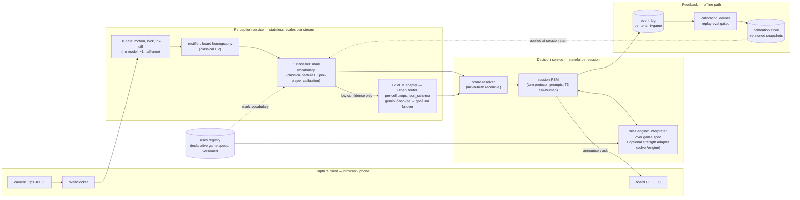

# Section 3 — A game-agnostic live-video game agent

What the built system (tic-tac-toe, single player, one process) becomes when it must accept *any* board game's rules and serve many users. The tic-tac-toe implementation is a vertical slice of this: same tiers, same boundaries, same ink-is-truth doctrine.

**End-to-end flow.** Frame → T0 gate (cheap CPU, every frame, drops ~99% of work) → on stable ink change: rectify + T1 classify (CPU worker) → low-confidence readings escalate to T2 (vision model via OpenRouter — speed-tier models, per-cell classification crops only; vendor-diverse failover in one request) → typed observation crosses to the decision service → resolver reconciles page vs committed state → FSM applies the game's turn protocol → rules engine returns/validates the reply move (search-based solver for solved/small games; engine adapters — Stockfish-class or an LLM move-proposer *always behind a legality validator* — for larger ones) → announcement back to the client (display + TTS). Alongside observations, per-frame board geometry (paper quad + projected cell polygons, a few hundred bytes) streams back to the capture client, which renders placement guides and the announced move directly on the live video. Offline: every session appends to the event log; the learner folds confirmed marks and escalation outcomes into per-(tenant, game) calibration snapshots.

**Services and boundaries.** Perception is stateless — any worker can process any frame given (stream id → locked homography, calibration ref); it scales horizontally per camera stream and owns nothing durable. Decision is stateful per session (committed board, turn, pending announcement) — tiny state, sticky-routed, owns the game truth. Only perception T2 needs an ML model at all; the decision service needs none (rules are interpreted, solvers are code). What crosses the boundary is small and typed — per-cell `{label, confidence}` readings, never pixels — which is what makes the perception fleet swappable (better CV, different VLM) without touching game logic.

**Rules ingestion.** A new game is a *document*, not a deploy: a declarative spec in the registry — board topology (grid dims / graph), mark vocabulary (symbols + reference glyphs for the classifier and VLM prompt), turn protocol (who moves when, what a legal move is, as validatable predicates), terminal conditions, and an optional strength adapter reference. The decision service interprets the spec; perception reads the vocabulary from it. Natural-language rules can be LLM-compiled into the spec format once, human-reviewed, then versioned in the registry — the compiler is tooling, not a runtime dependency.

**Shared and per-tenant.** Shared: all code, base thresholds, VLM prompt templates, the public rules registry, the vendor pool. Per-tenant: API keys/quotas, event logs, private game specs, and *all learned state* — calibration is keyed (tenant, game, player) because handwriting profiles are personal by construction. Nothing learned from one tenant ever flows into another's inference path; only aggregate, reviewed threshold defaults may graduate to shared config.

**Feedback at scale.** Learned state lives in the calibration store as append-only versioned snapshots, isolated by its (tenant, game, player) key — a bad profile's blast radius is one player of one game of one tenant, and by design a calibration can only *boost confidence toward* labels the classifier already produced (more asks at worst, never silent misreads). Promotion is gated: a new snapshot must beat its predecessor on a replay eval (recorded sessions re-run deterministically — the same mechanism as the local A/B test) before it activates; regression → automatic pin to the last passing snapshot.

**Versioning and failure.** Every decision logs the tuple (game spec version, calibration snapshot id, perception code version, VLM model id + request id), and because sessions are event-sourced, any disputed move replays deterministically from the log. Under load, T2 breaks first (vendor rate limits and tail latency) — it degrades per design into ask-the-human, and the game *continues*. Next is T1 CPU (scale out stateless workers; per-stream frame-dropping backpressure already bounds ingest — the newest frame always wins, queues never form). The decision tier and rules registry are last to fall: kilobytes of state and reads, respectively. The failure ordering is the cost ordering — the expensive tiers are exactly the optional ones.
